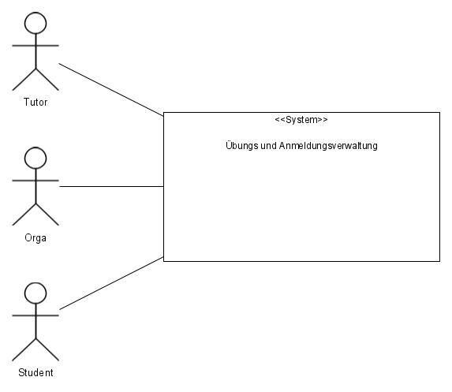
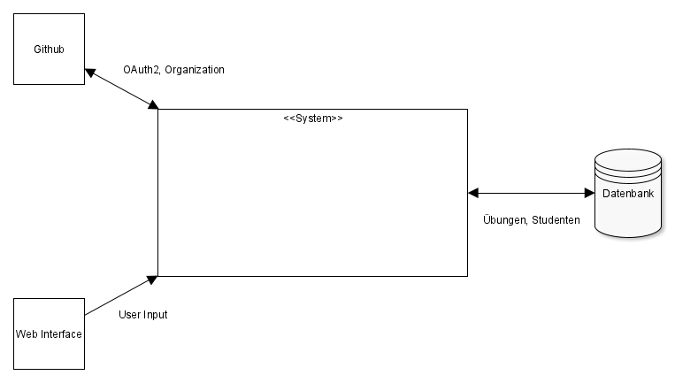

[[section-system-scope-and-context]]
== Kontextabgrenzung

=== Fachlicher Kontext

* vorgefertigte Termine
* Studenten
* Organisatoren
* Tutoren
* Verbindung zu Github
* Datenbank zur Persistierung von Studenten, Übungen und Terminen

=== Technischer Kontext

* (csv-Datei)
* Authentifizierung mit OAuth2
* Github API zur Erstellung von Repos und Zuteilung der Studenten
* Docker image von mariaDB
