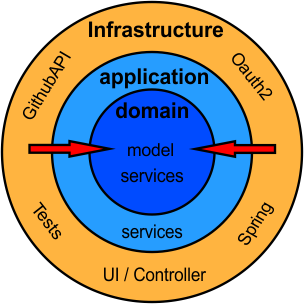

[[section-solution-strategy]]
== Lösungsstrategie

=== Onion-Architektur

* Architektur-Entscheidung
** Verschiedene Ebenen, die die Wartbarkeit fördern
** Leichte implementierung des DDD-Models
** Einfach nachzuvollziehen
** Gute Wartbarkeit durch klare Abgrenzung (Abhängigkeiten nach Innen)
** Simple Austauschmöglichkeiten für die Infrastructure Ebene

* DDD-Aggregate
** Übungen mit Termin Entitäten
** Termine besitzen Referenzen auf Studenten
** Studenten

