[[section-building-block-view]]
== Bausteinsicht

=== Whitebox Gesamtsystem

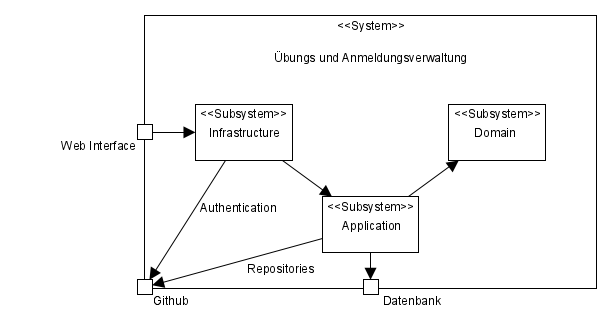

=== Domain

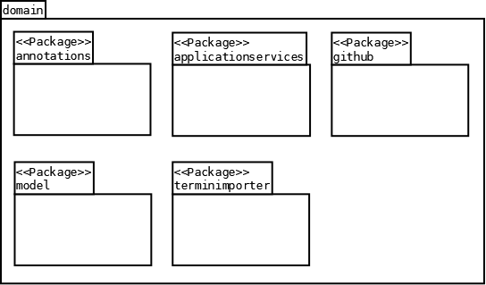

==== Models

===== Übung

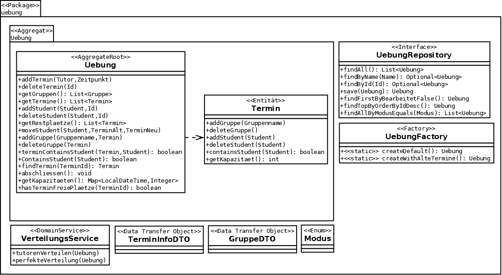

===== Student

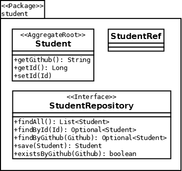

==== Application Services

image:../images/applicationservices-package.png[Blackbox-Gesamt]

===== Übungs Service

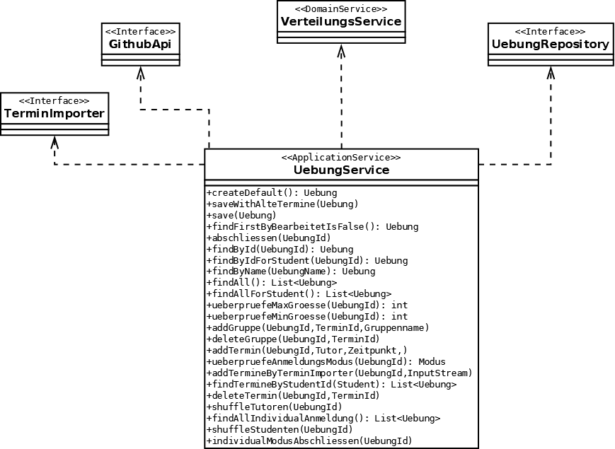

===== Student Service

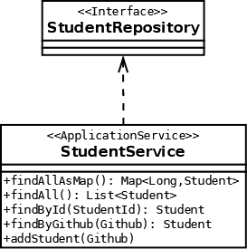

===== VerwaltungService Service

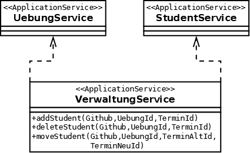

===== Anmeldungs Service

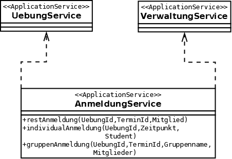

==== Github

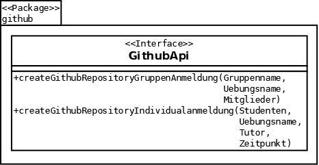

==== Termin Importer

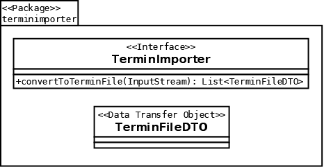

=== Infrastructure

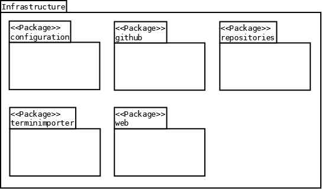

==== Repositories

===== Übungs Repository

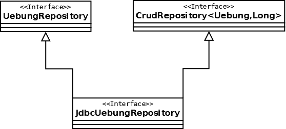

===== Student Repository

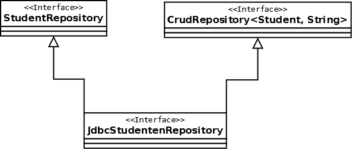

==== Github

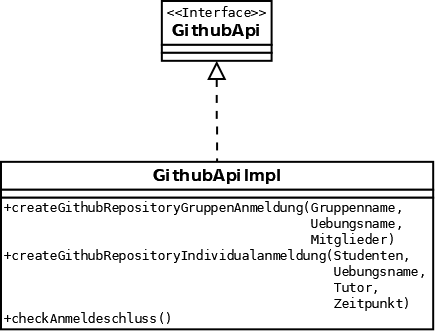

==== Termin Importer

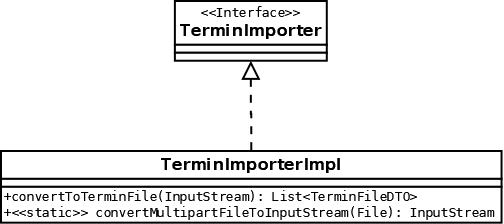
