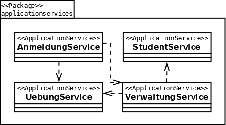

[[section-building-block-view]]
== Bausteinsicht

=== Whitebox Gesamtsystem

image:../images/blackbox-gesamt.png[Blackbox-Gesamt]

=== Domain

image:../images/domain-package.png[Blackbox-Gesamt]

==== Models

===== Übung

===== Student

image:../images/student-package.png[Blackbox-Gesamt]

==== Application Services

===== Übungs Service

image:../images/uebungservice.png[Blackbox-Gesamt]

===== Student Service

image:../images/studentservice.png[Blackbox-Gesamt]

===== VerwaltungService Service

image:../images/verwaltungservice.png[Blackbox-Gesamt]

===== Anmeldungs Service

image:../images/anmeldungservice.png[Blackbox-Gesamt]

==== Github

==== Termin Importer

=== Infrastructure

image:../images/infrastructure-package.png[Blackbox-Gesamt]

==== Repositories

===== Übungs Repository

===== Student Repository

image:../images/jdbcstudentenrepository.png[Blackbox-Gesamt]

==== Github

image:../images/githubapiimpl.png[Blackbox-Gesamt]

==== Termin Importer

