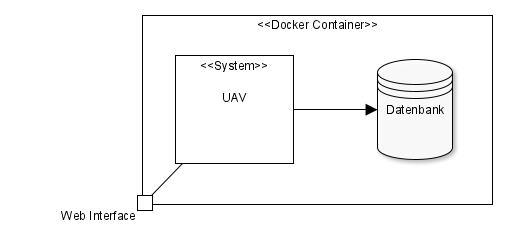
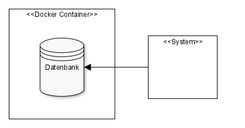

[[section-deployment-view]]
== Verteilungssicht

=== Produktions Infrastruktur

Erläuterung:: Im Docker-Container läuft die Application mit Portfreigabe und die Datenbank ohne Portfreigabe.

Begründung:: In der Produktion soll die Datenbank keine Portfreigabe nach außen geben, da der Zugriff nur über die Anwendung selbst statt finden soll.

=== Development / Test Infrastruktur

Erläuterung:: Im Docker-Container läuft die Datenbank mit Portfreigabe.

Begründung:: Für das Development / Tests kann die Datenbank alleine in einem Docker-Container mit offenem Port gestartet werden, da so nicht immer die Application im Docker-Container laufen muss